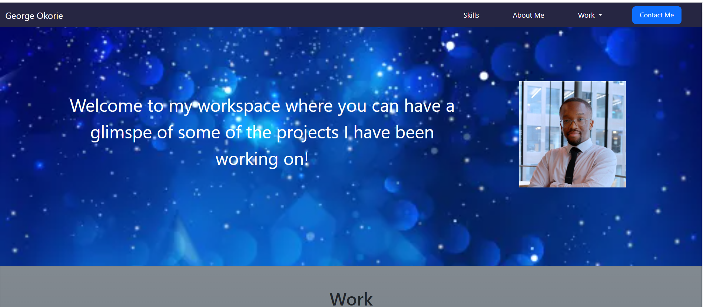
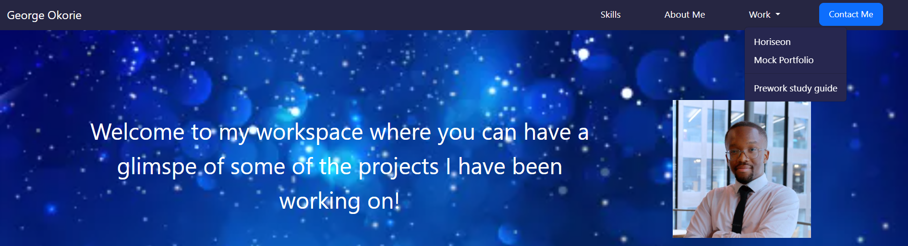

# Bootstrap-Portfolio

## Description

The Bootstrap portfolio was made using bootstrap. This was done to reduce the amount of css logic that is written to make a website responsive. In essence, bootstrap is a css framework that was used to reduce the number of media queries written to make a website responsive. 

Bootsrap makes it possible for a website to be repsonsive and saves the developer time that would have been used to write media queries for responsiveness.

## Usage
md
    

At the top is the navigation bar where the user can click and it will redirect the user to a specific section of the page or onto a new tab where the projects are located.

md
    

There is a drop down menu on the navigation bar under the work section where the user can click and be redirected to the web pages where the projects are located on a new tab. This makes it easier for the user to navigate between pages.

Here is a link to the deployed website on Github Pages: https://giorgiodavinci.github.io/Bootstrap-Portfolio/

## License
MIT